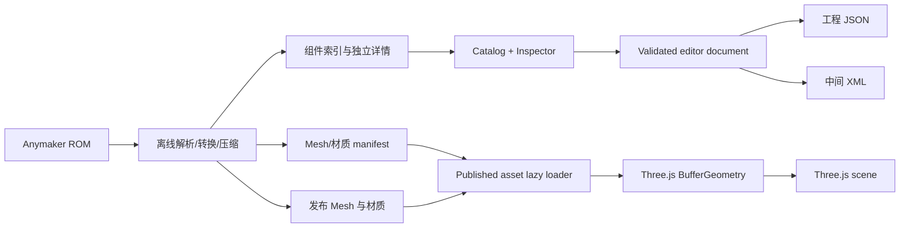

# Anymaker Builder 系统架构

## 目标和边界

项目是一个静态前端应用，构建产物可以直接部署到 GitHub Pages。正式发布的运行时不依赖后端、游戏进程、游戏安装目录或用户选择的资源文件；组件定义、已解析并转换的完整 Mesh、材质、纹理和 manifest 都随静态站点发布。浏览器本地文件选择仅保留为开发和资产审计工具。

当前产品边界分成三层：

1. **编辑器层**：Three.js 场景、相机、网格、工具、选择状态、Inspector、撤销/重做。
2. **发布资产层**：从 Anymaker ROM 离线提取、验证、转换和压缩后的组件定义、连接面、逻辑节点、静态/动态 Mesh、材质和纹理。
3. **交换格式层**：浏览器工程 JSON 和带 `game-compatible="false"` 标记的中间 XML。只有经过原生存档逆向和游戏回归后，才允许新增游戏兼容导出器。

## 目录职责

```text
src/
  main.js                 页面组合、事件协调、Three.js 场景生命周期
  assets/
    mesh.js               Anymaker .mesh v5 二进制解析器
    library.js            开发阶段本地 File 对象、解析缓存、Three.js 几何实例化
    published/            正式发布资产 manifest、lazy loader、解压和缓存
  editor/
    document.js           工程 schema、输入校验、XML 中间格式、历史快照
  components/             目标目录，尚未实现：每组件装配、端口和 Mesh 绑定模块
public/data/
  component-index.json    轻量搜索索引
  definitions/            每组件独立详情
  bindings/               每组件独立 Mesh 绑定
public/assets/
  manifests/              发布资产完整性与压缩清单
  meshes/                 每原始 Mesh 一个独立转换资产
  materials/              纹理、材质和压缩产物
scripts/
  extract-catalog.mjs     生成组件清单
  audit-assets.mjs        统计 ROM、验证 Mesh、记录 starter_vehicle.data
doc/                      架构、格式、逆向证据和阶段性设计文档
tests/
  unit.test.js            解析器、工程校验、历史和 XML 单元测试
  browser/                GitHub Pages 子路径下的 Playwright 工作流测试
```

## 运行时数据流



组件索引只负责搜索和资源引用，不承载 Three.js 运行对象或巨型模型数据。正式 `PublishedAssetLoader` 仅在组件被选中、放置或可见时请求对应的发布资产，检查 manifest 的 hash/版本，再解压和实例化；未使用资源不会进入内存。浏览器本地 `AssetLibrary` 不在发布链路中。

## 编辑器状态

- `definitions`：组件定义索引，键为稳定的 `id`。
- `objects`：当前为 Three.js 场景对象数组；导出快照只保存 `id/type/position/rotation/scale`，渲染诊断元数据不持久化。
- `History`：工程快照，不保存 Three.js 对象引用；撤销、重做和分支操作必须复制数据。
- `selected` 与 `tool`：短生命周期 UI 状态，不进入工程文件。
- `PublishedAssetLoader`：已发布资源状态，不进入工程文件；工程保存组件定义 ID，由绑定和 manifest 找到 lazy-loaded 资产。
- `AssetLibrary`：开发/审计辅助状态，不进入工程文件，也不属于 GitHub Pages 完整使用路径。

## 下一阶段的领域架构（尚未实现）

Project 包含 Vehicle、Grid、Component 和 Node/Edge/Plate/Link 图。当前场景数组将改为领域模型的渲染投影，纯数据 Command 负责预览、验证、提交及撤销。ID、坐标转换和拓扑重映射由共享领域模块实现。

节点/梁/面板在原生样本中位于 vehicle 层级；目标模型不能直接把它们全部强制塞入 grid。Grid 局部坐标与渲染 submesh 也必须分开。原生适配器负责表达游戏字段，中间 XML 适配器负责版本化的交换格式。

依赖方向为：UI → 命令/领域模型 → 验证与历史；Three.js 场景订阅领域变化；资源库提供模型；格式适配器读写领域数据。解析器不引用 UI，领域模型不持有 Three.js 对象。

具体文件和单组件资源结构见 [拆分方案](04_COMPONENT_MESH_SPLIT.md)，拓扑操作见 [建造操作](05_BUILD_OPERATIONS.md)。

## 约束

- 不把 `I:\`、`D:\` 或游戏 EXE 路径写入生产运行时资源。
- 正式部署不允许出现“请导入游戏目录”“缺失本地 Mesh 才能使用”这类前置条件；Pages 资产 manifest 必须覆盖全部已承诺组件及其动态/材质依赖。
- 压缩只优化传输和存储。每个发布 Mesh 必须可从原始资源路径、hash、转换器版本及量化/压缩参数追溯，且压缩前后几何和材质验收通过。
- 不在浏览器端信任导入 JSON 的组件、数值、ID 或 XML 字符串；导入前做 schema、范围、重复 ID 和定义存在性检查。
- 不把中间 XML 称为游戏存档；页面 UI 和文件注释都必须保留兼容性否定标记。
- 当前不规划触屏、平板或移动端布局；桌面浏览器和鼠标键盘是本阶段支持平台。
